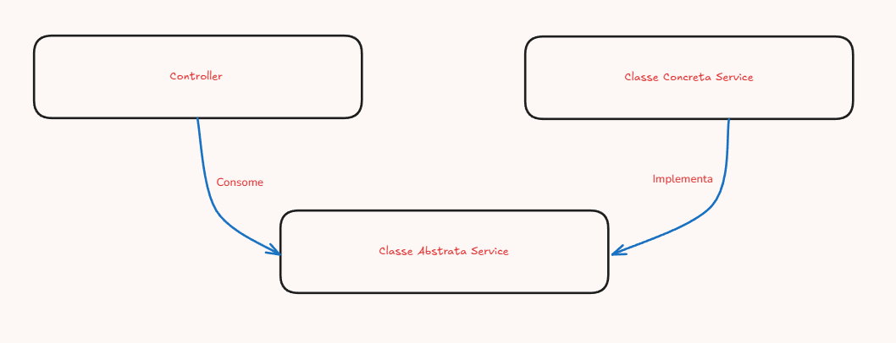

# Iris

Uma aplicação **full-stack** para cadastro e gerenciamento de clientes com cores associadas e autenticação via JWT.

---

## 🚀 Visão Geral

Iris é uma plataforma que permite:
- **Cadastro de clientes** com nome, CPF, e-mail, observações e cor associada
- **Autenticação** de usuários (login/logout) usando JWT
- **Gestão de cores** para categorizar clientes
- **Dashboard** para visualização, filtragem e paginação de clientes
- **Tecnologias modernas**: NestJS, Prisma, PostgreSQL, React, Vite, React Query, Ant Design e Tailwind CSS

---

## 🗂 Estrutura de Diretórios

```
.
├── api
│   ├── prisma
│   │   ├── schema.prisma  # Definição do modelo de dados
│   │   └── seed.ts        # Seed inicial do banco de cores e usuário
│   └── src
│       ├── common         # DTOs, interceptors e constantes globais
│       ├── modules
│       │   ├── auth       # Autenticação (login, guard, JWT)
│       │   ├── clientes   # Endpoints de clientes (CRUD + paginação)
│       │   ├── cores      # Endpoints de cores (CRUD + paginação)
│       │   └── usuarios   # Endpoint /usuarios/me
│       ├── shared         # Configurações, banco (Prisma) e decoradores
│       ├── app.module.ts  # Módulos globais e guard padrão
│       └── main.ts        # Bootstrap do NestJS
├── front
│   ├── src
│   │   ├── app
│   │   │   ├── contexts   # Contexto de autenticação
│   │   │   ├── hooks      # React Query hooks (clientes, cores, auth)
│   │   │   ├── services   # Chamadas HTTP para API
│   │   │   └── utils      # Helpers (CPF, sleep, classNames)
│   │   ├── router         # Proteção de rotas e definição de rotas
│   │   └── view
│   │       ├── components # Componentes compartilhados (Input, Spinner, etc)
│   │       ├── modal      # Componentes de modal (CoresModal)
│   │       ├── pages      # Páginas da aplicação
│   │       └── layouts    # Layout de autenticação
│   ├── index.html
│   └── vite.config.ts     # Configuração do Vite + Tailwind
└── docker-compose.yml     # Orquestração Docker (Postgres, API, Front)
```

---

## ⚙️ Tecnologias

- **Back-end**  
    - [NestJS](https://nestjs.com/) 
    - [Prisma ORM](https://www.prisma.io/) v6.11 + PostgreSQL 16
    - JWT + `bcryptjs` para autenticação segura
    - Class-validator, Zod e interceptors para validação e paginação

- **Front-end**  
    - [React](https://reactjs.org/) v19 + [Vite](https://vitejs.dev/) v6
    - TypeScript
    - [React Query](https://tanstack.com/query) para gerenciamento de estado e requisições
    - [React Hook Form](https://react-hook-form.com/) para gerenciamento de formulários
    - [Ant Design](https://ant.design/) para componentes UI
    - [Tailwind CSS](https://tailwindcss.com/) v4 para estilos

- **Infraestrutura**  
    - Docker & Docker Compose
    - PostgreSQL 16

---

## 📋 Pré-requisitos

- [Docker](https://www.docker.com/) e Docker Compose (para execução containerizada)

---

## 🔧 Instalação

1. **Clone o repositório**  
     ```bash
     git clone <URL_DO_REPO>
     cd iris
     ```

## ▶️ Como Executar

### 🚀 Usando Docker Compose

```bash
docker-compose up --build
```

- O contêiner `db` executa o PostgreSQL
- O serviço `app` roda migrações e inicia o NestJS
- O serviço `front` serve a aplicação React na porta 80


### 🔑 **Credenciais de Acesso**

Após executar o projeto, use as credenciais padrão para acessar como administrador:

```
📧 E-mail: joe.doe@example.com
🔐 Senha: senha_secreta
```

> ⚠️ **Importante**: Estas são credenciais de demonstração criadas automaticamente pelo seed do banco de dados.

---

## 📚 Endpoints Principais da API

| Método | Rota | Descrição | Autenticação |
|--------|------|-----------|--------------|
| POST | `/auth/login` | Autentica usuário, retorna JWT | Não |
| POST | `/clientes` | Cria novo cliente | Não |
| GET | `/clientes` | Lista clientes (paginado) | Sim |
| GET | `/clientes/:id` | Retorna cliente por ID | Sim |
| POST | `/cores` | Cria nova cor | Sim |
| GET | `/cores` | Lista cores (paginado) | Não |
| GET | `/cores/:id` | Retorna cor por ID | Sim |
| PUT | `/cores/:id` | Atualiza cor | Sim |
| DELETE | `/cores/:id` | Remove (soft delete) cor | Sim |
| GET | `/usuarios/me` | Retorna dados do usuário autenticado | Sim |

## 🛠 Funcionalidades

- **Autenticação JWT**: Proteção de rotas, refresh de sessão embutido no client
- **Validação**: DTOs com class-validator e Zod para payloads HTTP
- **Paginação**: Interceptor global para respostas paginadas
- **Seed Inicial**: Cores do arco-íris + usuário demo (joe.doe@example.com / senha_secreta)
- **Interface Intuitiva**: Filtragem por CPF e paginação no dashboard

---

## 🧩 Injeção e Inversão de Dependência

O projeto implementa o princípio de Inversão de Dependência (SOLID) através do sistema de injeção de dependências do NestJS:



Como mostrado no diagrama:

- **Controllers** consomem classes abstratas (interfaces/abstract classes)
- **Classes Concretas** implementam as interfaces
- O sistema de DI do NestJS conecta automaticamente as implementações concretas

Esta abordagem proporciona:

- **Baixo acoplamento**: Componentes dependem de abstrações, não de implementações
- **Testabilidade**: Facilidade para mockar dependências em testes unitários
- **Manutenibilidade**: Alterações em implementações não afetam os consumidores

---

## 🎨 Decorators Personalizados

O projeto utiliza decorators customizados para simplificar operações comuns:

### Autenticação e Autorização

- **`@isPublic()`** - Marca rotas como públicas, dispensando autenticação JWT
  ```typescript
  @Get('cores')
  @isPublic()
  async findAll() { ... }
  ```

- **`@activeUserId`** - Extrai o ID do usuário autenticado do token JWT
  ```typescript
  @Get('me')
  async getProfile(@activeUserId userId: string) { ... }
  ```


### Validação

- **`@Zod(schema)`** - Aplica validação usando schemas Zod nos endpoints
  ```typescript
  @Post()
  @Zod(createClienteSchema)
  async create(@Body() dto: CreateClienteDto) { ... }
  ```

### Paginação

- **`@IsPaginated()`** - Ativa interceptor de paginação para respostas estruturadas
  ```typescript
  @Get()
  @IsPaginated()
  async findAll(@Query() query: PaginationDto) { ... }
  ```

Estes decorators estão localizados em [`/api/src/shared/decorators`](api/src/shared/decorators) e seguem as convenções do NestJS para metadata e dependency injection.


## 🧠 Decisões Técnicas

### Backend

- **NestJS**: Escolhido por sua arquitetura modular baseada em decoradores e pela forte tipagem com TypeScript, facilitando a manutenção e escalabilidade do projeto.

- **Prisma ORM**: Adotado pela segurança de tipos, migrações automáticas e excelente integração com TypeScript, eliminando a necessidade de ORM mais verbosos.

- **JWT para Autenticação**: Implementado por ser stateless e facilitar a escalabilidade horizontal sem depender de estado de sessão no servidor.

- **Arquitetura Modular**: Separação clara entre módulos (auth, clientes, cores) para facilitar manutenção e seguir princípios SOLID.

### Frontend

- **React + Vite**: Escolhido pela performance superior do Vite em desenvolvimento e produção comparado ao Create React App.

- **React Query**: Adotado para gerenciar estado de servidor, caching inteligente e reduzir boilerplate de fetch/state.

- **Ant Design + Tailwind**: Combinação que oferece componentes prontos com alto nível de customização via utilitários CSS.

- **React Hook Form**: Selecionado pela performance e facilidade de integração com validação de esquemas com o zod.

- **Contexto de Autenticação**: Centraliza lógica de auth e refresh de token, simplificando o gerenciamento de sessões.

### Infraestrutura

- **Docker Compose**: Utilizado para garantir ambiente de desenvolvimento consistente e facilitar implantação.

- **PostgreSQL**: Escolhido pela confiabilidade, suporte a JSON e recursos avançados como busca textual.

- **Migrations Automáticas**: Implementadas via Prisma para garantir consistência do banco de dados entre ambientes.
